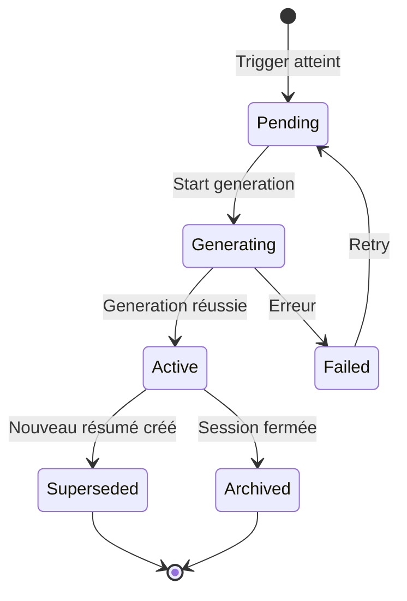

# Compression Hiérarchique - Plan Détaillé

Ce document détaille la stratégie de compression hiérarchique pour gérer efficacement les longues conversations en plusieurs niveaux (L1, L2, L3, ..., Lx).

## 🎯 Objectifs

1. **Gérer les contextes longs**: Permettre des conversations illimitées sans perdre l'historique
2. **Optimiser les coûts**: Réduire le nombre de tokens envoyés aux LLMs
3. **Préserver la sémantique**: Conserver les informations importantes à travers les niveaux
4. **Accès flexible**: Permettre le RAG sur tous les niveaux de résumés

---

## 📊 Architecture de Compression

```
┌─────────────────────────────────────────────────────────┐
│                  Messages bruts (M1, M2, ..., Mn)        │
│                  (stockés en permanence)                 │
└───────────────────────┬─────────────────────────────────┘
                        │
           ┌────────────┴────────────┐
           │  CompressionTrigger     │  ← Surveille tokens
           │  (détecte seuils)       │
           └────────────┬────────────┘
                        │
           ┌────────────▼────────────┐
           │  L1 Generator           │  ← Résumés locaux
           │  (tous les N messages)  │
           └────────────┬────────────┘
                        │
                ┌───────▼───────┐
                │  L1 Summaries │
                │  (S1, S2, ...) │
                └───────┬───────┘
                        │
           ┌────────────▼────────────┐
           │  L2 Generator           │  ← Meta-résumés
           │  (quand M L1 existent)  │
           └────────────┬────────────┘
                        │
                ┌───────▼───────┐
                │  L2 Summaries │
                │  (SS1, SS2, ...) │
                └───────┬───────┘
                        │
           ┌────────────▼────────────┐
           │  L3 Generator           │  ← Ultra-condensé
           │  (session complète)     │
           └────────────┬────────────┘
                        │
                ┌───────▼───────┐
                │  L3 Summary   │
                │  (Session-wide) │
                └───────────────┘
```

---

## ⚙️ Triggers de Compression - Règles Précises

### Niveau 1 (L1) - Résumés Locaux

**Déclenchement**: L'un des critères suivants est atteint

| Critère | Seuil par défaut | Configurable |
|---------|------------------|--------------|
| **Nombre de messages** | Tous les 10 messages | ✅ `l1MessageThreshold` |
| **Tokens cumulés** | Tous les 2000 tokens | ✅ `l1TokenThreshold` |
| **Durée écoulée** | Toutes les 1 heure | ✅ `l1TimeThreshold` |

**Comportement**:
```typescript
// À chaque nouveau message, vérifier:
if (
  uncompressedMessageCount >= config.l1MessageThreshold ||
  uncompressedTokens >= config.l1TokenThreshold ||
  timeSinceLastL1 >= config.l1TimeThreshold
) {
  generateL1Summary(messagesToCompress);
}
```

**Exemple**:
- Messages 1-10 → L1-Summary-1 (couvre M1-M10)
- Messages 11-20 → L1-Summary-2 (couvre M11-M20)
- Messages 21-30 → L1-Summary-3 (couvre M21-M30)

### Niveau 2 (L2) - Meta-Résumés

**Déclenchement**: L'un des critères suivants est atteint

| Critère | Seuil par défaut | Configurable |
|---------|------------------|--------------|
| **Nombre de L1** | 5 résumés L1 | ✅ `l2SummaryThreshold` |
| **Tokens L1 cumulés** | 4000 tokens | ✅ `l2TokenThreshold` |
| **Session longue** | 100 messages | ✅ `l2MessageThreshold` |

**Comportement**:
```typescript
// Quand un nouveau L1 est créé, vérifier:
const uncompressedL1s = await getUncompressedL1Summaries(sessionId);

if (
  uncompressedL1s.length >= config.l2SummaryThreshold ||
  sumTokens(uncompressedL1s) >= config.l2TokenThreshold
) {
  generateL2Summary(uncompressedL1s);
}
```

**Exemple**:
- L1-Summary-1 à L1-Summary-5 → L2-Summary-1 (couvre M1-M50)
- L1-Summary-6 à L1-Summary-10 → L2-Summary-2 (couvre M51-M100)

### Niveau 3 (L3) - Ultra-Condensé

**Déclenchement**: L'un des critères suivants est atteint

| Critère | Seuil par défaut | Configurable |
|---------|------------------|--------------|
| **Nombre de L2** | 3 résumés L2 | ✅ `l3SummaryThreshold` |
| **Tokens L2 cumulés** | 6000 tokens | ✅ `l3TokenThreshold` |
| **Session très longue** | 500 messages | ✅ `l3MessageThreshold` |

**Comportement**:
```typescript
// Quand un nouveau L2 est créé, vérifier:
const uncompressedL2s = await getUncompressedL2Summaries(sessionId);

if (
  uncompressedL2s.length >= config.l3SummaryThreshold ||
  sumTokens(uncompressedL2s) >= config.l3TokenThreshold
) {
  generateL3Summary(uncompressedL2s);
}
```

**Exemple**:
- L2-Summary-1 à L2-Summary-3 → L3-Summary-1 (couvre M1-M150)

### Niveau 4+ (Lx) - Extension Récursive

Pour des sessions **extrêmement longues** (milliers de messages), on peut étendre récursivement:

```typescript
// Configuration générique pour Lx
interface LevelConfig {
  level: number;
  parentLevel: number;
  summaryThreshold: number;  // Combien de résumés du niveau précédent
  tokenThreshold: number;    // Limite en tokens
}

// L4 résume des L3, L5 résume des L4, etc.
```

---

## 🧠 Stratégies de Compression par Niveau

### L1 Strategy: Résumé Détaillé

**Objectif**: Conserver le maximum de détails tout en réduisant les tokens de ~50%

**Prompt Template**:
```
You are summarizing a conversation segment for future reference.

CONTEXT:
- Session: {{sessionTitle}}
- Participants: {{participantNames}}
- Time range: {{startTime}} to {{endTime}}
- Message count: {{messageCount}}

MESSAGES TO SUMMARIZE:
{{messages}}

INSTRUCTIONS:
1. Preserve all key facts, decisions, and action items
2. Keep technical details (code snippets, file paths, function names)
3. Maintain the conversation flow and context
4. Note any unresolved questions or pending tasks
5. Target length: ~50% of original token count

SUMMARY FORMAT:
## Overview
[1-2 sentences describing the main topic]

## Key Points
- [Important fact 1]
- [Important fact 2]
...

## Decisions Made
- [Decision 1 with reasoning]
...

## Action Items
- [Task 1]
- [Task 2]

## Technical Details
- Files: [list]
- Functions: [list]
- Concepts: [list]

## Unresolved
- [Question 1]
...
```

**Taux de compression**: ~50% (2000 tokens → ~1000 tokens)

---

### L2 Strategy: Synthèse Thématique

**Objectif**: Regrouper par thèmes et éliminer les redondances (~70% compression)

**Prompt Template**:
```
You are creating a meta-summary from multiple conversation summaries.

CONTEXT:
- Session: {{sessionTitle}}
- Total messages covered: {{totalMessages}}
- Time span: {{timeSpan}}

SUMMARIES TO SYNTHESIZE:
{{l1Summaries}}

INSTRUCTIONS:
1. Identify overarching themes and topics
2. Merge related discussions
3. Eliminate redundant information
4. Keep critical decisions and outcomes
5. Target length: ~30% of combined L1 summaries

SYNTHESIS FORMAT:
## Themes
[Identify 3-5 main themes discussed]

## Major Decisions
[Key decisions with impact]

## Technical Artifacts
[Files created/modified, functions implemented]

## Progress & Outcomes
[What was accomplished]

## Open Items
[What remains to be done]
```

**Taux de compression**: ~70% (5 L1 × 1000 tokens = 5000 → ~1500 tokens)

---

### L3 Strategy: Vue d'Ensemble Exécutive

**Objectif**: Vue ultra-condensée de toute la session (~80% compression)

**Prompt Template**:
```
You are creating an executive summary of an entire conversation session.

CONTEXT:
- Session: {{sessionTitle}}
- Duration: {{duration}}
- Total messages: {{totalMessages}}
- Participants: {{participants}}

META-SUMMARIES:
{{l2Summaries}}

INSTRUCTIONS:
1. Provide a high-level overview of the entire session
2. Focus on outcomes and impact
3. List major milestones
4. Ultra-concise format
5. Target length: 200-400 tokens

EXECUTIVE SUMMARY FORMAT:
## Session Overview
[2-3 sentences describing the session's purpose and scope]

## Key Outcomes
1. [Major outcome 1]
2. [Major outcome 2]
3. [Major outcome 3]

## Technical Deliverables
- [Deliverable 1]
- [Deliverable 2]

## Next Steps
[What should happen next]
```

**Taux de compression**: ~80% (3 L2 × 1500 tokens = 4500 → ~800 tokens)

---

## 🔍 Algorithme de Sélection de Contexte

Lors de la génération d'une réponse, comment sélectionner le contexte optimal?

### ContextWindowManager

```typescript
interface ContextBudget {
  maxTokens: number;           // Budget total (ex: 8000)
  reserveForMessages: number;  // Tokens réservés pour messages récents
  availableForSummaries: number; // Tokens disponibles pour résumés
}

interface ContextSelection {
  recentMessages: Message[];   // Messages récents (non résumés)
  l1Summaries: SessionSummary[];
  l2Summaries: SessionSummary[];
  l3Summary?: SessionSummary;
  totalTokens: number;
}

class ContextWindowManager {
  async selectOptimalContext(
    sessionId: string,
    budget: ContextBudget
  ): Promise<ContextSelection> {

    // 1. Toujours inclure les N derniers messages non résumés
    const recentMessages = await this.getRecentUncompressed(
      sessionId,
      budget.reserveForMessages
    );

    let remainingBudget = budget.availableForSummaries;
    const selection: ContextSelection = {
      recentMessages,
      l1Summaries: [],
      l2Summaries: [],
      totalTokens: sumTokens(recentMessages)
    };

    // 2. Si L3 existe et budget limité, utiliser L3 uniquement
    if (remainingBudget < 2000) {
      const l3 = await this.getLatestL3(sessionId);
      if (l3) {
        selection.l3Summary = l3;
        selection.totalTokens += l3.tokens;
        return selection;
      }
    }

    // 3. Stratégie hybride: L2 récents + L3 ancien si disponible
    if (remainingBudget >= 2000) {
      // Prendre les L2 les plus récents
      const recentL2s = await this.getRecentL2Summaries(
        sessionId,
        Math.floor(remainingBudget * 0.6) // 60% du budget
      );
      selection.l2Summaries = recentL2s;
      remainingBudget -= sumTokens(recentL2s);

      // Si encore de la place, ajouter le L3 pour contexte global
      const l3 = await this.getLatestL3(sessionId);
      if (l3 && l3.tokens <= remainingBudget) {
        selection.l3Summary = l3;
        remainingBudget -= l3.tokens;
      }
    }

    // 4. Si encore de la place, ajouter des L1 récents non couverts par L2
    if (remainingBudget > 0) {
      const uncoveredL1s = await this.getUncoveredL1Summaries(
        sessionId,
        selection.l2Summaries
      );

      for (const l1 of uncoveredL1s) {
        if (l1.tokens <= remainingBudget) {
          selection.l1Summaries.push(l1);
          remainingBudget -= l1.tokens;
        } else {
          break;
        }
      }
    }

    selection.totalTokens = this.calculateTotalTokens(selection);
    return selection;
  }

  /**
   * Pour RAG sémantique: chercher dans tous les niveaux
   */
  async semanticSearch(
    sessionId: string,
    query: string,
    budget: number
  ): Promise<ContextSelection> {
    // Recherche vectorielle sur messages + L1 + L2 + L3
    const allResults = await Promise.all([
      this.messageStore.semanticSearch(sessionId, query, 10),
      this.summaryStore.semanticSearchL1(sessionId, query, 5),
      this.summaryStore.semanticSearchL2(sessionId, query, 3),
      this.summaryStore.semanticSearchL3(sessionId, query, 1)
    ]);

    // Fusionner et trier par relevance
    const merged = this.mergeAndRank(allResults);

    // Sélectionner les top résultats dans le budget
    return this.fillBudget(merged, budget);
  }
}
```

---

## 📈 Métriques de Compression

Pour surveiller la santé du système de compression:

```typescript
interface CompressionMetrics {
  sessionId: string;

  // Counts
  totalMessages: number;
  l1Count: number;
  l2Count: number;
  l3Count: number;

  // Compression ratios
  l1CompressionRatio: number;  // (originalTokens - l1Tokens) / originalTokens
  l2CompressionRatio: number;
  l3CompressionRatio: number;
  overallCompressionRatio: number;

  // Token savings
  tokensSavedByCompression: number;
  estimatedCostSavings: number;

  // Performance
  averageL1GenerationTime: number;
  averageL2GenerationTime: number;
  averageL3GenerationTime: number;

  // Quality (si feedback disponible)
  summaryQualityScore?: number;
  informationLossScore?: number;
}
```

---

## 🛠️ Configuration Complète

```typescript
export interface CompressionConfig {
  enabled: boolean;

  // L1 Triggers
  l1MessageThreshold: number;      // Default: 10
  l1TokenThreshold: number;        // Default: 2000
  l1TimeThreshold: number;         // Default: 3600 (seconds)
  l1Strategy: 'detailed' | 'concise';
  l1TargetCompressionRatio: number; // Default: 0.5

  // L2 Triggers
  l2SummaryThreshold: number;      // Default: 5
  l2TokenThreshold: number;        // Default: 4000
  l2MessageThreshold: number;      // Default: 100
  l2Strategy: 'thematic' | 'chronological';
  l2TargetCompressionRatio: number; // Default: 0.7

  // L3 Triggers
  l3SummaryThreshold: number;      // Default: 3
  l3TokenThreshold: number;        // Default: 6000
  l3MessageThreshold: number;      // Default: 500
  l3Strategy: 'executive' | 'technical';
  l3TargetCompressionRatio: number; // Default: 0.8

  // Context Window
  defaultContextBudget: number;    // Default: 8000
  reserveForRecentMessages: number; // Default: 2000

  // Embeddings
  generateEmbeddingsForSummaries: boolean; // Default: true

  // Model
  summarizationModel: string;      // Default: 'gemini-pro'
  summarizationTemperature: number; // Default: 0.3

  // Advanced
  enableSemanticDeduplication: boolean; // Default: true
  regenerateSummariesOnEdit: boolean;   // Default: false
}
```

---

## 🔄 Cycle de Vie d'un Résumé



**États**:
- **Pending**: En attente de génération
- **Generating**: Génération en cours
- **Active**: Actuellement utilisé pour le contexte
- **Failed**: Échec de génération (retry possible)
- **Superseded**: Remplacé par un résumé de niveau supérieur
- **Archived**: Session terminée, conservé pour historique

---

## 💡 Cas d'Usage Avancés

### 1. Session avec Branches

Si la conversation a plusieurs threads parallèles:
```typescript
// Générer des L1 par thread
for (const threadId of activeThreads) {
  if (shouldCompressThread(threadId)) {
    await generateL1ForThread(sessionId, threadId);
  }
}

// Les L2 fusionnent les threads
await generateL2AcrossThreads(sessionId);
```

### 2. Compression Sélective par Agent

Certains agents peuvent avoir besoin de plus de détails:
```typescript
// Agent de code review a besoin de L1 complets
const codeReviewContext = {
  recentMessages: last10Messages,
  l1Summaries: allL1sWithCodeDetails,
  l2Summaries: [] // Pas de L2, trop de perte d'info
};

// Agent de documentation peut utiliser L2/L3
const docAgentContext = {
  recentMessages: last5Messages,
  l2Summaries: recentL2s,
  l3Summary: sessionL3
};
```

### 3. Re-génération Adaptative

Si un utilisateur demande plus de détails sur une partie résumée:
```typescript
// Détecter la demande
if (userAsksAbout(topic) && topicIsInL2) {
  // Récupérer les L1 originaux ou même les messages
  const detailedContext = await getOriginalMessages(topic);

  // Répondre avec contexte détaillé
  return generateResponseWithContext(detailedContext);
}
```

---

## 📋 Checklist d'Implémentation

- [ ] Créer `CompressionTrigger` class
- [ ] Implémenter stratégies L1/L2/L3
- [ ] Créer `ContextWindowManager`
- [ ] Implémenter sélection de contexte optimal
- [ ] Ajouter métriques de compression
- [ ] Tests unitaires pour chaque niveau
- [ ] Tests d'intégration bout-en-bout
- [ ] Documentation utilisateur
- [ ] Exemples de configuration
- [ ] Benchmarks de performance
